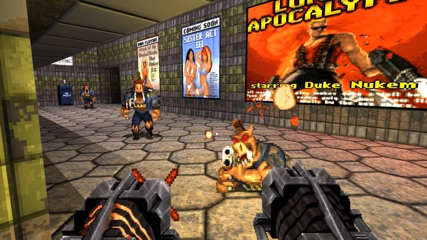
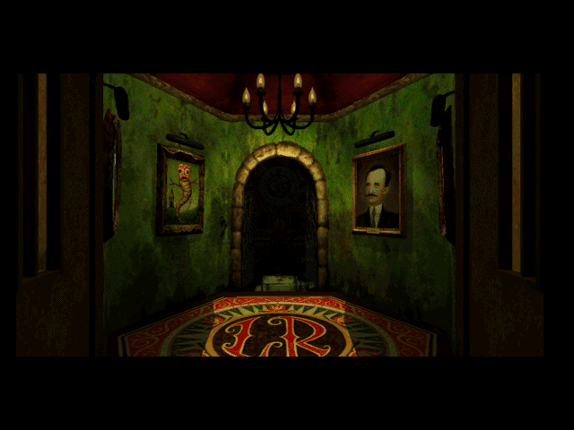
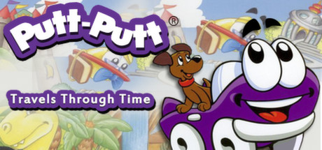

Hi Vincent.

Hi y' all.

Growing up, I was the fat, nerdy kid who did no sports. I sat in front of the computer all day, every day.

I remember I was around the age of 5 or 6 (?) when introduced to my first DOS/Win 3.1, then Win 95 machine by my parents. I double-clicked on every single icon and fiddled with all the checkboxes and options in the Control Panel... For fun.

Once I got bored of MS Paint, Solitaire and the like, I started to ask for more.

I remember my mom bringing me to a PC games warehouse sale around that time in my childhood. I picked up some awesome titles from that sale too. [Duke Nukem 3D](https://en.wikipedia.org/wiki/Duke_Nukem_3D) and [9: The Last Resort](https://en.wikipedia.org/wiki/9:_The_Last_Resort) were the most memorable, as they were my first impressions of PC games.

_Duke Nukem 3D_ was my first exposure to FPS (First Person Shooter) games. It provided me an almost too soon a peek into the Hollywood-esque Macho Man Action Hero trope, skimpy blonde girls, gory aliens and all. My mom, like all other Malaysian aunties, ignored the age rating on these boxes. I was super impressed that the mirrors actually reflected my character in the game. Mind blowing PC gaming tech for 1996. I'm actually super proud and impressed of my mom for introducing me to this title as my first PC game.

_9: The Last Resort_ was a confusing experience for 7-year-old me, discounting the fact that the concept and art direction was creepy as all hell. All my clicking and double clicking experience brought me no where but the first two or three screens of the game. I remember giving up and popping the CD back into the CD drive countless times, thinking I've gained more knowledge to solve it each time, only to give up again.

Lucky for little boy me, the title choices got milder from there. I remember playing Putt Putt a lot. Putt Putt Goes To The Moon. Putt Putt Saves The Zoo... Actually I can't remember the titles, but they all featured Putt Putt, the friendly purple anamorphic convertible and his pet dog. I loved them so much. These games taught me time travel, continuity, problem solving skills, cause and effect, English, pattern recognition and so much more. I'd let my kids play them any day. The voice acting was on point too! [Humongous Entertainment](https://en.wikipedia.org/wiki/Humongous_Entertainment), you made my PC gaming childhood. Pajama Sam comes in a close second, then some fish character (Freddy Fish?) that wasn't so memorable.

My PC Gaming adventure didn't end there, this is where I'll stop and continue in my next post. It's 1:44AM. Please understand.
