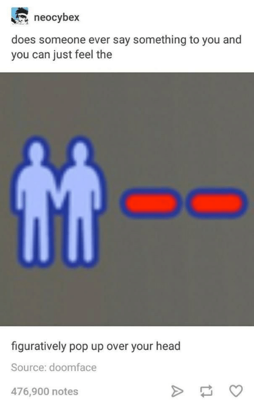
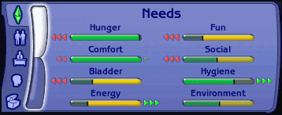
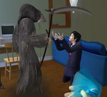
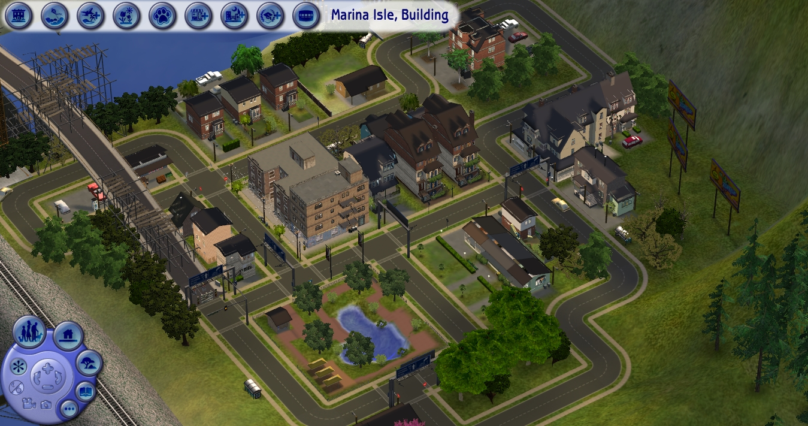

> DISCLAIMER: Making sense of this story requires some basic knowledge of the game "The Sims". This happened a long time ago, so do expect inconsistencies in my retelling of the game mechanics.

I love [The Sims](https://en.wikipedia.org/wiki/The_Sims). It's a game in which you get to play god... Or dollhouse with your computer. I used to play it all the time. I still do, but I used to, [too](https://www.youtube.com/watch?v=ndBjraV-3UY).

About a decade or so ago, I played a lot of The Sims 2.

Back then, I also had friends over at my place all the time. Sometimes they watch me play games. Sometimes we play together. Sometimes I watch them play. One time, I watched my good friend Kah Yan play The Sims 2.

For context, I also installed all the expansions. Don't ask me how or _if_ I _bought_ all the expansions. I won't tell you, but the point is that I had the full The Sims 2 experience to enjoy. It's important for me to mention this because you get to play as a vampire if you wanted to.

Now, Kah Yan was not a newbie to The Sims, as she watched her friends play it all the time, and she also played it once in a while. This time, she played with the sole aim of having a vampire sim (a playable character) to play with. It's no easy feat, too. You have to do a series of actions within the game, in order to get another vampire sim to "turn" your sim. The difficulty is in finding that other vampire sim and building a strong bilateral relationship with it. There's also limited time to interact per encounter due to the nature of night-day mechanics. And then there's the wait for a random chance to be “turned”.

First, she built the sim a house. She put up four walls, painted them, put windows and doors in them and then filled it with furniture enough for the sim to live with minimal function.

Then, she started her vampire hunt. She made her sim go to all the spots where a vampire sim would show up. She made sure her visits were at night and she plotted her visits to places a vampire was more likely to show up. I didnt't know what those were, but she did her research.

Finally, she found a vampire sim!

She made sure to invite the vampire out at any chance she had. Each time spamming all possible social interactions before the sun rises. Each time making sure that her sim had the greenest of [plumbobs](https://sims.fandom.com/wiki/Plumbob). Green (and gold or platinum) plumbobs show that her sim was in the best of moods to succeed at its interactions. Every interaction she made her sim do had better resulted in a _Relationship++_. Otherwise, it was a step back towards her goal.

A slew of "_Share Interests_" and "_Hugs_" later, her sim and the vampire sim were the best of buds.

It was time.

The _moment of truth_.

The vampire BFF approached the sim and _bit its neck_!

Her sim was now a vampire! 🧛‍♂️

For Kah Yan, it was a milestone. It was time to play as a vampire sim, after hours of trying to turn into one.

But her sim behaves otherwise. The plumbob hanging from the sim was turning ever so orange. It was changing towards a redder hue with each passing moment.

Wait, but _why_?! Why was the sim's mood decaying?

No! Oh no, no...

Not after all the effort turning it into a vampire! She paused the game. It was time to think. Her heart started racing, and beads of sweat were visibly forming on her forehead. (Must have been warm in my room.) She furrowed her eyebrows and seemed to be deep in thought.

So... _What_ was it? Why was her sim turning moody all of a sudden? We had our eyes stuck to the screen, scanning for every sign of possible aggression towards her sim.

I remember pointing out that the newly-turned vampire sim was now sizzling and smoking...

_OF COURSE!_

We found that she had the vampire sim hanging outside its house _and_ the clock just hit 6AM, so it was the sunlight! _Whew_, glad we found that out soon enough, or it was death for her sim!

She hurriedly clicked on the floor inside the house and commanded the sizzling sim to "_Go here_". Her brows relaxed, but only for a brief moment. When she saw, with horror in her eyes, that the sim continued to sizzle _indoors_... She started panicking and asked me for ideas on whatever the hell was going on.

We paused the game and pondered. Well, it was daytime and the windows were letting sunlight in, with no blinds installed... So, why don't we try adding blinds then?

She did that and resumed the game, both of us anticipating, grimacing. Yet red was still the colour of the plumbob. It was not getting any better. All the bars on the needs tab were decaying. There were three red triangles on the wrong side of all bars, signalling the fastest depletion of needs. It was pushing us to be creative with the possible causes.

> Let's buy a coffin and have the sim sleep in it.

It was a good idea, but the sim wouldn't budge. It was _too sleepy to sleep_. (It's common for sims to disobey commands when depressed.) And even when it did try, the plumbob stayed crimson, and the needs bars all kept decreasing. And it would wake up again. It was no use.

> Let's remove the windows!

Of course, what other brilliant ideas can we come up with? Blinds were no use, we had to remove all light sources possible! Remove all the windows, _AND_ the internal lighting, lamps and TV or computers! We can't have daylight _OR_ artificial light harming the fresh vampire sim! It's fragile!

_What?!_ No light source, no windows, but still no use... Ah, sure, it must be the _DOORS!_ Removing the doors seemed like the final move, it had to be! That or it had to be a darned bug that costed her _hours_ of tedious hard work playing the game.

After everything, we were left with a confused, sizzling and still smoking sim. One which turned vampire only moments ago, now in a windowless and doorless room with nowhere to run to.

Think of a worse grave for a sim.

The plumbob, now redder than a ripe tomato, seemed like a glaring invitation to Death himself. Still sizzling and smoking, the sim collapsed to the ground and took its final digital breath. It was no more.

Fine, Kah Yan thought, stupid game. It was just a disappointing bug, it had got to be. She lost interest, moved on and did something else. So I took over the controls of the computer to play with my sim instead.

As I switched into the neighbourhood view to select and play with my sim family, it all made sense. The house she built was part of the neighbourhood view and was in clear sight.

**There was no roof.**

> First, she built the sim (the player character) a house. She put up four walls, painted them, put windows and doors \[...\]
